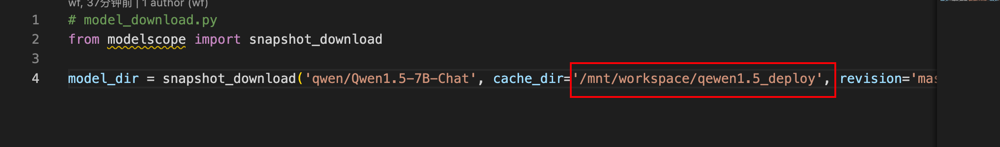
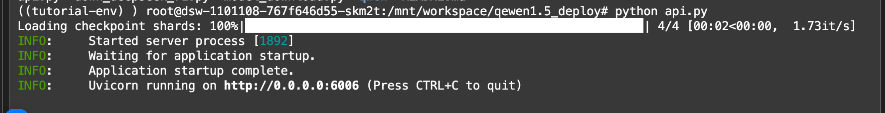
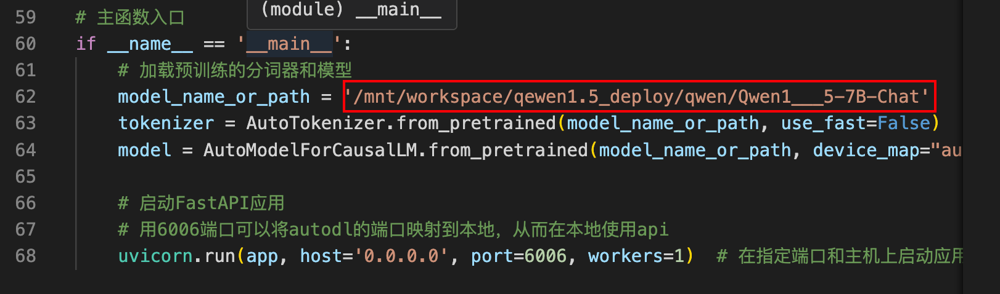

# 通义千问1.5大模型部署指南

## 1. 环境准备

### 系统要求
- 操作系统: Ubuntu 22.04
- Python: 3.12 (其他版本可能不兼容)
- CUDA: 12.1
- PyTorch: 2.3.0

### 虚拟环境配置
为避免包冲突，建议使用Python虚拟环境：

```bash
# 创建虚拟环境
python3.12 -m venv myvenv

# 激活虚拟环境
source myvenv/bin/activate

# 安装依赖
pip install -r requirements.txt
```
## 2. 模型下载

使用魔塔社区的下载脚本下载模型：

```bash
python model_download.py
```

注意事项：
- 根据模型大小，下载时间会有所不同
- 请根据实际情况修改模型下载目录
- 下载完成后，请确认模型文件完整



## 3. API服务部署

启动API服务：

```bash
python api.py
```

注意事项：
- 请确保已正确设置模型路径
- 默认服务端口为6006




## 4. 接口测试

### 请求示例
```bash
curl -X POST "http://127.0.0.1:6006" \
     -H 'Content-Type: application/json' \
     -d '{"prompt": "你好，请做个自我介绍", "history": []}'
```

### 预期响应
```json
{
    "response": "您好，我是AI助手，全名通义千问。由阿里云研发，我是一款大型预训练语言模型，专门设计用于理解和生成各语言文本，如对话、写作、问答等。我可以帮助您解答问题、提供信息、进行创作，还能与您进行多轮互动，就像现在这样。在 中，如有任何问题或需要帮助，请随时告诉我，我会尽力提供支持。",
    "status": 200,
    "time": "2025-06-27 11:04:32"
}
```

## 5. 常见问题
1. 如果遇到CUDA相关错误，请检查CUDA版本是否匹配
2. 服务启动失败时，请检查模型路径是否正确
3. 如需修改服务端口，请编辑api.py中的配置